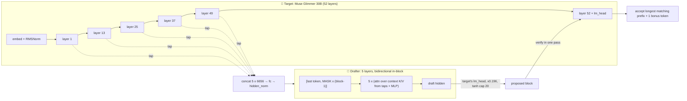
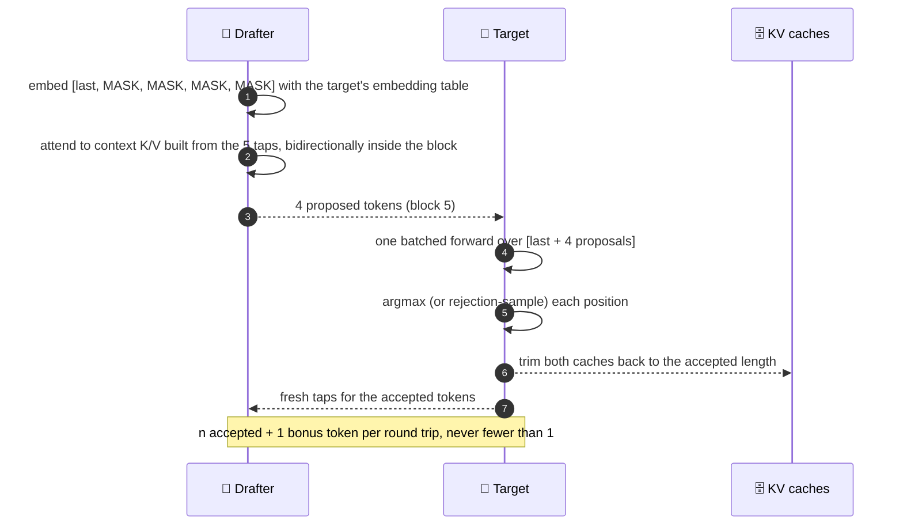
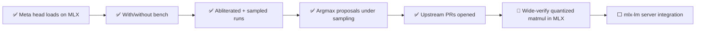

<div align="center">

# ⚡ DFlash on MLX for Muse Glimmer 30B

### Speculative decoding for Meta's open 30B agent model, on Apple Silicon, with the drafter Meta shipped 🍎

[](#-hardware-and-method)
[](https://github.com/ml-explore/mlx)
[](https://github.com/ml-explore/mlx-lm)
[](https://huggingface.co/meta-models/Muse-Glimmer-30B)
[](https://huggingface.co/meta-models/Muse-Glimmer-30B-assistant)
[](https://github.com/z-lab/dflash)
[](LICENSE)
[](#-results)

**Before this branch there was no way to run Meta's DFlash drafter on a Mac.** 🚫🍎
Now `meta-models/Muse-Glimmer-30B-assistant` loads straight off Hugging Face into z-lab's MLX backend, no weight conversion, and speeds up greedy decoding by **1.17x** at block 5 on a 4-bit target. z-lab's own DFlash 2 head does **1.25x**. 📈

</div>

---

## 🗺️ Contents

| | | |
|---|---|---|
| [🎯 TL;DR](#-tldr) | [📊 Results](#-results) | [🧠 How DFlash works](#-how-dflash-works) |
| [🚀 Quick start](#-quick-start) | [🔧 What this branch changes](#-what-this-branch-changes) | [🔬 Correctness](#-correctness-greedy-equality-is-not-an-oracle-at-bf16) |
| [🖥️ Hardware and method](#-hardware-and-method) | [⚠️ Caveats](#-caveats) | [🛣️ Roadmap](#-roadmap) |

---

## 🎯 TL;DR

| Question | Answer |
|---|---|
| 🤔 Is there an MLX version of Meta's Glimmer drafter? | **Now there is.** This branch. The loader reads Meta's repo as published, so there is nothing to convert or re-upload. |
| 🏎️ How much faster? | **1.17x** greedy with Meta's head, **1.25x** with z-lab's DFlash 2 head, both at block 5 on `mlx-community/Muse-Glimmer-30B-4bit`. |
| 📦 Block 16 like on CUDA? | **No.** On a quantized MLX target, block 16 is *slower* than no draft at all (0.80x). Use block 5. |
| 🧊 Does quantizing the 5 GB head to 4-bit hurt? | **No.** Acceptance 2.93 vs 2.99 tokens per step, and it is slightly faster. |
| 🔓 Does it work on an abliterated target? | **Yes.** Acceptance is unchanged (2.96 vs 2.93). The head was distilled against the stock model but the residual stream it reads survives abliteration. |
| 🎲 Sampling at temperature 1? | **Yes, after one fix.** z-lab's v1 loop sampled block positions independently and Meta's head collapsed to 0.45x. Proposing argmax and rejection-sampling against it (what vLLM does) brings it to **1.18x** at block 5, same acceptance as greedy. DFlash 2 does 1.28x. |

---

## 📊 Results

Six prompts, 256 new tokens each, chat template with `Reasoning strength: low`, single request at a time. Baseline is plain `mlx_lm.stream_generate` on the same target. Speedup is mean generation tok/s over the baseline's mean. Every number below is produced by `bench/aggregate.py` from the JSONL files in `bench/runs/`, so re-running the bench regenerates the tables.

### 🏁 With vs without the draft, stock 4-bit target (greedy)

| draft | block | tok/s | speedup | accept / step | peak GB |
|---|---:|---:|---:|---:|---:|
| ❌ none (plain mlx-lm) | - | 40.7 | 1.00x | - | 15.8 |
| 🟦 Meta assistant, bf16 | 5 | 45.8 | 1.12x | 2.99 | 21.0 |
| 🟦 Meta assistant, bf16 | 8 | 38.5 | 0.95x | 3.58 | 21.0 |
| 🟦 Meta assistant, 4-bit | **5** | **47.6** | **1.17x** | 2.93 | 21.5 |
| 🟦 Meta assistant, 4-bit | 8 | 40.8 | 1.00x | 3.63 | 21.5 |
| 🟦 Meta assistant, 4-bit | 16 | 32.6 | 0.80x | 4.68 | 21.5 |
| 🟩 z-lab DFlash 2, 4-bit | **5** | **50.8** | **1.25x** | 3.36 | 21.9 |
| 🟩 z-lab DFlash 2, 4-bit | 8 | 45.8 | 1.13x | 4.19 | 21.9 |
| 🟩 z-lab DFlash 2, 4-bit | 16 | 37.0 | 0.91x | 5.47 | 21.9 |

> 💡 **Acceptance goes up with block size, throughput goes down.** A wider verify batch means more accepted tokens per target pass, but MLX's quantized matmul gets slower per token at wide verify widths, and the extra drafted tokens are wasted whenever the target rejects early. Block 5 is the crossover on this hardware. z-lab's README already warns about this for quantized MLX targets, and Glimmer confirms it.

### 🧪 Per-prompt tok/s (accepted tokens per step in parentheses), stock 4-bit, greedy

| prompt | baseline | DFlash 2 b5 | Meta b5 | DFlash 2 b8 | Meta b8 |
|---|---:|---:|---:|---:|---:|
| 🧭 factual one-liner | 41.2 | 32.9 (2.9) | 40.8 (2.5) | 39.6 (3.6) | 31.7 (2.8) |
| 💻 code | 40.9 | **60.0** (3.8) | 56.9 (3.5) | 52.7 (4.8) | 46.0 (4.0) |
| 📝 300-word essay | 40.4 | 39.6 (2.5) | 33.9 (2.1) | 30.1 (2.7) | 28.8 (2.5) |
| 🧮 math word problem | 40.7 | **64.5** (4.1) | 54.5 (3.4) | 60.3 (5.5) | 47.8 (4.2) |
| 🧾 JSON extraction | 40.5 | **73.2** (4.6) | 64.6 (4.0) | 67.0 (6.2) | 64.7 (5.8) |
| 🈶 Chinese explanation | 40.6 | 34.6 (2.2) | 34.7 (2.2) | 25.2 (2.3) | 25.9 (2.3) |

> 🎯 **The draft pays off on structured output and reasoning.** JSON and math hit 1.6x to 1.8x. Free prose and multilingual text sit at or below baseline because the drafter guesses fewer tokens right, and every miss costs a wasted verify slot. The factual prompt is only ~90 tokens long, so warm-up dominates.

### 🔓 Abliterated target (`shoemoney/Muse-Glimmer-30B-Abliterated-MLX-q4`, greedy)

| draft | block | tok/s | speedup | accept / step |
|---|---:|---:|---:|---:|
| ❌ none | - | 40.4 | 1.00x | - |
| 🟦 Meta assistant, 4-bit | 5 | 41.0 | 1.01x | 2.96 |
| 🟦 Meta assistant, 4-bit | 8 | 36.0 | 0.89x | 3.49 |
| 🟩 z-lab DFlash 2, 4-bit | 5 | **49.1** | **1.21x** | 3.24 |
| 🟩 z-lab DFlash 2, 4-bit | 8 | 42.3 | 1.05x | 3.97 |

> 🔍 Acceptance on the abliterated model is within 0.1 of the stock model for both heads. The Meta head's speedup on it is inside run-to-run noise; the DFlash 2 head holds its gain.

### 🎲 Sampling (temperature 1, top-p 0.95, top-k 64, Meta's published settings), stock 4-bit

| draft | block | tok/s | speedup | accept / step |
|---|---:|---:|---:|---:|
| ❌ none | - | 40.1 | 1.00x | - |
| 🟦 Meta assistant, 4-bit, before fix (independent per-position sampling) | 5 | 18.2 | 0.45x | 1.16 |
| 🟦 Meta assistant, 4-bit, before fix | 8 | 12.8 | 0.32x | 1.16 |
| 🟦 Meta assistant, 4-bit, argmax proposals | **5** | **47.2** | **1.18x** | 2.96 |
| 🟦 Meta assistant, 4-bit, argmax proposals | 8 | 38.6 | 0.96x | 3.49 |
| 🟩 z-lab DFlash 2, 4-bit | **5** | **51.4** | **1.28x** | 3.35 |
| 🟩 z-lab DFlash 2, 4-bit | 8 | 46.8 | 1.17x | 4.34 |

> 🎲 Same rejection sampler, three outcomes. DFlash 2 keeps its greedy speedup under sampling because its candidate selector picks a *coherent* block. z-lab's v1 loop sampled every block position independently from its marginal, so Meta's head proposed incoherent blocks the target rejected. This branch now proposes the argmax token per position for v1 heads and rejection-samples against a one-hot proposal, which is what vLLM does: the accept test becomes `u < p(token)` and the residual is the target distribution minus that token, so the output distribution is exactly the target's. Acceptance under sampling then matches greedy.

<details>
<summary>📂 Which JSONL is which</summary>

| file | unit |
|---|---|
| `baseline-4bit.jsonl` | A. Plain mlx-lm, stock 4-bit, greedy |
| `B-dflash2-4bit.jsonl` | B. DFlash 2 head, blocks 5/8/16, greedy |
| `C-meta-4bit.jsonl` | C. Meta head 4-bit, blocks 5/8/16, greedy |
| `C-meta-bf16.jsonl` | C. Meta head bf16, blocks 5/8, greedy |
| `D-baseline-abl.jsonl`, `D-dflash2-abl.jsonl`, `D-meta-abl.jsonl` | D. Abliterated target |
| `E-baseline-sampled.jsonl`, `E-meta-sampled.jsonl`, `E-dflash2-sampled.jsonl` | E. Published sampling settings (`E-meta-sampled` is the pre-fix run) |
| `E-meta-sampled-argmax.jsonl` | E. Meta head after the argmax-proposal fix |

Each row keeps the full generated token list, so any comparison in this README can be recomputed offline.

</details>

---

## 🧠 How DFlash works

Muse Glimmer's drafter is not a small language model. It is a 5-layer block-diffusion head that **reads the target's residual stream** at five layers and proposes a whole block of tokens in one forward pass. The target then verifies the block in one batched pass. Accepted tokens are, by construction, exactly what the target would have produced.



One decode step, as the MLX loop runs it:



<details>
<summary>🔩 Why Meta's head is "Qwen3-shaped" and what that bought us</summary>

The checkpoint's tensor names are `layers.N.self_attn.{q,k,v,o}_proj`, `q_norm`, `k_norm`, `input_layernorm`, `post_attention_layernorm`, `mlp.{gate,up,down}_proj`, plus `encoder.fc` and `encoder.output_norm_enc`. That is exactly the layout z-lab's v1 `DFlashDraftModel` already implements for Qwen3 drafters, and vLLM's own `MuseGlimmerAssistantConfig` subclasses `Qwen3Config` for the same reason. So the port did not need a new layer class. It needed three things vLLM also patches in:

| what | value | why it matters |
|---|---|---|
| weight remap | `encoder.fc.` → `fc.`, `encoder.output_norm_enc.` → `hidden_norm.` | same tensors, different names |
| `vocab_size` | 202048 (absent from the checkpoint) | Qwen3's default 151936 would silently misindex the mask token |
| `is_causal` | `False` | the head attends bidirectionally inside the block; z-lab's loader would default sliding layers to causal |

The head has no embedding table and no lm_head. It borrows both from the target at bind time, and draft logits get the target's `output_multiplier` and `final_logit_softcapping` so draft probabilities live on the target's scale for rejection sampling.

</details>

---

## 🚀 Quick start

```bash
# Apple Silicon. mlx-lm from git main (the PyPI release predates Glimmer).
uv venv --python 3.12 .venv
uv pip install --python .venv/bin/python "mlx>=0.32" "git+https://github.com/ml-explore/mlx-lm.git" huggingface_hub tqdm
uv pip install --python .venv/bin/python --no-deps -e .

# Generate with Meta's drafter, 4-bit head, block 5 (the sweet spot on quantized MLX targets)
.venv/bin/dflash generate mlx \
    --model mlx-community/Muse-Glimmer-30B-4bit \
    --draft meta-models/Muse-Glimmer-30B-assistant \
    --draft-bits 4 --block-size 5 --reasoning low \
    "How many positive whole-number divisors does 196 have?"

# Same with z-lab's DFlash 2 head (faster, and it survives sampling)
.venv/bin/dflash generate mlx \
    --model mlx-community/Muse-Glimmer-30B-4bit \
    --draft z-lab/Muse-Glimmer-30B-DFlash2 \
    --draft-bits 4 --block-size 5 --reasoning low \
    "How many positive whole-number divisors does 196 have?"
```

### 📏 Reproduce the tables

```bash
# Baseline, then a draft run checked against it
.venv/bin/python -m dflash.bench_mlx --model mlx-community/Muse-Glimmer-30B-4bit \
    --max-tokens 256 --reasoning low --out runs/baseline.jsonl
.venv/bin/python -m dflash.bench_mlx --model mlx-community/Muse-Glimmer-30B-4bit \
    --draft meta-models/Muse-Glimmer-30B-assistant --draft-bits 4 --block-sizes 5,8,16 \
    --max-tokens 256 --reasoning low --baseline runs/baseline.jsonl --out runs/meta.jsonl

# The whole matrix, sequentially (edit the model ids at the top)
sh bench/run_all.sh

# Markdown tables from any directory of JSONL runs
python bench/aggregate.py runs/
```

`bench_mlx.py` flags: `--model`, `--draft`, `--draft-bits {4,8}`, `--block-sizes 5,8,16`, `--temperature`, `--top-p`, `--top-k`, `--max-tokens`, `--prompts file.json`, `--reasoning`, `--baseline prior.jsonl`, `--out`.

---

## 🔧 What this branch changes

| file | change |
|---|---|
| `dflash/model_mlx.py` | 🗂️ Draft loading goes through a registry keyed on `config.architectures[0]`. Each entry is a model class, a config normalizer, and a weight-key remap. `DFlash2DraftModel` keeps its old behavior; `MuseGlimmerAssistantModel` is new. `num_target_layers` became optional. `bind()` inherits the target's logit multiplier and softcap when the draft config leaves them at defaults. Under sampling, v1 heads now propose argmax tokens and rejection-sample against a one-hot proposal instead of sampling each block position independently. |
| `dflash/bench_mlx.py` | 📊 New. With/without-draft benchmark that writes one JSONL row per prompt and block size, with the full token list and a SHA-256 of it. |
| `dflash/bench_prompts.json` | 🧪 New. The six default prompts. |
| `tests/test_muse_glimmer_adapter.py` | ✅ New. Weight-free: real checkpoint configs and safetensors headers as fixtures; asserts the remapped key set equals the model's parameter set for both heads, and that an unknown architecture raises. 7 tests, pass in under a second. |
| `bench/` | 🔬 The runs behind this README, the aggregator, the near-tie probe, and the run script. |
| `docs/UPSTREAM_README.md` | 📚 z-lab's original README, unchanged. |

The generate loop, attention, rejection sampler and cache handling are untouched.

---

## 🔬 Correctness: greedy equality is not an oracle at bf16

The obvious test for speculative decoding is "greedy output with the draft must equal greedy output without it, token for token". On this hardware it does not hold, and the reason is the target, not the draft.

The bench compares token SHAs, and most rows diverged somewhere between position 27 and 242 of 256, never at the start, with the same divergence index recurring across block sizes on a given prompt. `bench/near_tie_probe.py` replays the baseline's own tokens through the **target alone**, once one token per step and once as a single batched forward, and reports the top-2 logit margin at those positions:

| prompt @ position | single-step argmax (margin) | batched argmax (margin) |
|---|---|---|
| 0 @ 27 | 15266 (0.0625) | **10239** (0.0000) |
| 4 @ 100 | 220 (0.19) | 220 (0.44) |
| 2 @ 63 | 20436 (0.25) | 20436 (0.06) |

Logits here live under a tanh cap of 20 in bf16, so a margin of 0.0625 is one rounding step. The target flips its own argmax depending on how many tokens are in the batch, with no draft involved. Speculative decoding always verifies in batches, so its greedy output legitimately differs from single-token decode at these near-ties. What the algorithm does guarantee, and what the loop enforces by construction, is that every accepted token is the target's argmax under the verify batching. Healthy acceptance (3 to 9 tokens per step on structured prompts) is the evidence that the taps, embeddings and cache trimming are wired correctly: a misaligned tap would crater acceptance to ~1 from the first token.

---

## 🖥️ Hardware and method

| | |
|---|---|
| 🖥️ Machine | Mac Studio, Apple M3 Ultra, 103 GB unified memory |
| 🧰 Software | macOS, Python 3.12, `mlx` 0.32.2, `mlx-lm` 0.32.0 from git main, this branch |
| 🐘 Targets | `mlx-community/Muse-Glimmer-30B-4bit`, `shoemoney/Muse-Glimmer-30B-Abliterated-MLX-q4` (both affine 4-bit, group 64) |
| 🐇 Drafters | `meta-models/Muse-Glimmer-30B-assistant` (DFlash v1, 5.11 GB bf16), `z-lab/Muse-Glimmer-30B-DFlash2` (5.54 GB bf16), each run bf16 or quantized to 4-bit at load |
| 📝 Prompts | 6, listed in `dflash/bench_prompts.json`, chat template with `Reasoning strength: low` |
| 🔁 Protocol | 256 new tokens per prompt, one request at a time, one model pair loaded at a time, `mx.random.seed(0)` |
| 📐 Metric | mlx-lm's `generation_tps` (tokens per second after prefill), mean over prompts; acceptance is accepted tokens per verify step averaged per prompt then over prompts |

Meta's own numbers for the K-Quant-17GB target plus quantized drafter were 1.5x on M4 Max and 1.8x on M5 Max via ExecuTorch, and 3.1x on an RTX 5090. The MLX path is behind that today because of the wide-verify matmul cost above, not because of acceptance.

---

## ⚠️ Caveats

- 🎲 **Sampling with a v1 head needs argmax proposals.** Upstream z-lab's loop samples each block position from its own marginal, and Meta's head then accepts 1.16 tokens per step. This branch proposes argmax for v1 heads (the vLLM behavior), which restores greedy-level acceptance. If you run upstream's loop instead, use the DFlash 2 head when sampling.
- 📦 **Block sizes above 5 lose on quantized MLX targets.** Acceptance keeps rising but tok/s falls. This is an MLX kernel property at wide verify widths, not a Glimmer property.
- 🧵 **Single request only.** The MLX loop is batch-1. Server-style concurrency is vLLM territory.
- 🖼️ **Text only.** mlx-lm's Glimmer port implements the language tower; the perception encoder is dropped at load.
- 🌡️ **Numbers are one machine, one run per cell.** Expect a few percent of run-to-run noise; the abliterated-target Meta-head rows are inside it.

---

## 🛣️ Roadmap



| milestone | state |
|---|---|
| Meta's v1 head loads through a draft-adapter registry, tests green | ✅ done, measured on M3 Ultra |
| With/without-draft benchmark with token-level artifacts | ✅ done |
| Abliterated target and published-sampling runs | ✅ done |
| Argmax proposals for v1 heads under sampling (0.45x to 1.18x) | ✅ done, measured |
| Upstream PRs to z-lab/dflash: [#168](https://github.com/z-lab/dflash/pull/168) adapter + bench, [#169](https://github.com/z-lab/dflash/pull/169) argmax proposals | ✅ opened |
| Faster wide-verify path for quantized targets on MLX (unlock block 8 to 16) | 🔨 next |
| Draft support inside `mlx_lm.server` | ⬜ planned |

---

## 🙏 Credits

- 🧪 [z-lab/dflash](https://github.com/z-lab/dflash) for DFlash, DFlash 2, the MLX backend this branch extends, and the `Muse-Glimmer-30B-DFlash2` head.
- 🦙 Meta Superintelligence Lab for [Muse Glimmer 30B](https://huggingface.co/meta-models/Muse-Glimmer-30B) and its [assistant head](https://huggingface.co/meta-models/Muse-Glimmer-30B-assistant), both Apache 2.0.
- 🍎 The [mlx-lm](https://github.com/ml-explore/mlx-lm) maintainers for the Glimmer text-tower port.
- 🔍 vLLM's `qwen3_dflash.py` and `MuseGlimmerAssistantConfig`, which documented the weight remap, the vocab size trap, and the non-causal block.

Licensed MIT, same as upstream. See [`LICENSE`](LICENSE).

---

<div align="center">

🐇 *The drafter guesses, the elephant checks, and nobody has to wait for 52 layers five times in a row.* 🐘

</div>
